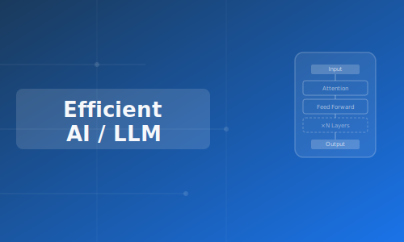
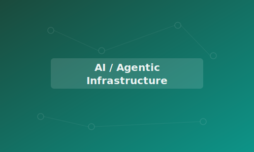
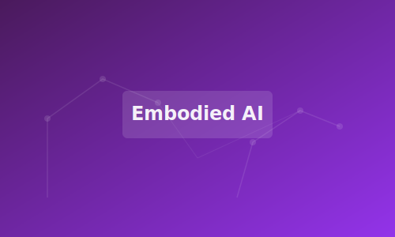
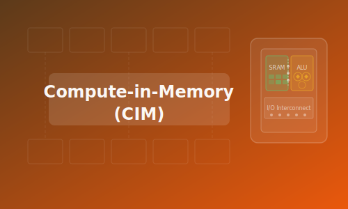

We are currently leading several research projects in the areas of intelligent computing systems and AI infrastructure.

  
  

    <h3>Efficient LLM Inference and Deployment</h3>
    
Focusing on the hardware-aware optimization of LLMs and diffusion LLMs (dLLMs) for resource-constrained environments. This research bridges algorithm and architecture by exploring ultra-low precision quantization, memory-bound bottleneck alleviation, and highly efficient execution engines to accelerate generative AI on edge devices.

  

  
  

    <h3>Full-Stack AI Infrastructure and Agentic Systems</h3>
    
Architecting scalable inference frameworks and robust systems tailored for heterogeneous computing platforms. This domain addresses deep learning compiler optimization, automated operator tuning, and dynamic resource allocation, providing the foundational system support required for complex, agent-driven workflows and large-scale model serving.

  

  
  

    <h3>Full-Stack Systems for Embodied Intelligence</h3>
    
Investigating system-level solutions to bridge the gap between multimodal perception and physical actuation in robotic systems. This research develops low-latency, energy-efficient processing architectures specifically designed for the real-time execution of Vision-Language-Action (VLA) models and World Models in autonomous agents.

  

  
  

    <h3>Compute-in-Memory (CIM) Architectures and Tools</h3>
    
Pioneering next-generation computing paradigms to overcome the von Neumann memory wall. The scope encompasses the microarchitecture design of digital CIM for AI workloads, coupled with the development of comprehensive design toolchains to streamline the synthesis and integration of CIM systems.

  

  
  

    <h3>Cryptographic Architectures and Systems</h3>
    
Designing Domain-Specific Architectures (DSAs) and accompanying software ecosystems to accelerate computationally intensive cryptographic protocols. The focus encompasses hardware-level optimization for Post-Quantum Cryptography (PQC), Fully Homomorphic Encryption (FHE), and Zero-Knowledge Proofs (ZKP) to enable secure, trustless computing environments.

  

