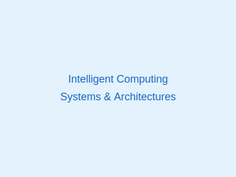
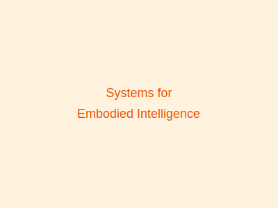

Our research group (CI-Lab) focuses on advancing the frontiers of intelligent computing through innovative research and development. Below are our main research interests.

  
  

    <h3>Intelligent Computing Systems and Architectures</h3>
    
We explore novel computer architectures designed for intelligent computing workloads, including accelerator design, hardware-software co-optimization, and domain-specific architectures for AI applications.

  

  
  

    <h3>ML/LLM Systems and Infrastructure</h3>
    
We research efficient systems and infrastructure for machine learning and large language models, covering training/inference optimization, distributed systems, and resource management for large-scale AI workloads.

  

  
  

    <h3>Systems for Embodied Intelligence</h3>
    
We investigate computing systems that bridge AI with the physical world, including robotics systems, real-time perception-processing pipelines, and edge-cloud collaborative architectures for embodied AI applications.

  

